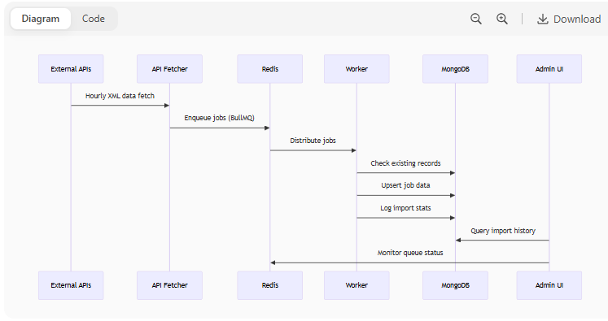

# Job Import System Architecture

## System Overview


The Job Import System is a distributed, queue-based processing pipeline that:

1. Fetches job listings from multiple external APIs  
2. Processes them through a Redis-backed queue  
3. Stores results in MongoDB  
4. Provides monitoring through a Next.js dashboard

---

## Core Components

### 1. API Fetcher Service

**Responsibility**: Poll external job APIs and enqueue raw data

**Design Decisions**:

- **Scheduled Fetching**: Uses `node-cron` for hourly executions  
- **XML Conversion**: Leverages `xml2js` for API response normalization  
- **Bulk Enqueue**: Processes multiple jobs in batches to reduce Redis overhead

```javascript
// Example fetch-enqueue flow
async function fetchAndEnqueue(apiUrl) {
  const rawData = await fetchXML(apiUrl);
  const jobs = convertToJSON(rawData);
  await queue.addBulk(jobs.map(job => ({ name: 'import', data: job })));
}
```

---

### 2. Queue System (BullMQ + Redis)

**Topology**:

- **Primary Queue**: `job-import`  
- **Dead Letter Queue**: `job-import-failed`  
- **Priority Queues**: `high-priority-imports` (for premium sources)

**Configuration**:

- **Concurrency**: 5 workers (configurable)  
- **Retry**: 3 attempts with exponential backoff  
- **Timeout**: 30 seconds per job

---

### 3. Worker System

**Processing Logic**:

- Validate incoming job data  
- Check MongoDB for existing records  
- Determine if job is new/needs update  
- Apply transformations  
- Store results

**Error Handling**:

- **Validation failures** → Immediate fail  
- **Transient errors** → Automatic retry  
- **System failures** → Dead-letter queue

---

### 4. Data Storage (MongoDB)

**Collections**:

#### `jobs`: Processed job listings

```javascript
{
  _id: ObjectId,
  externalId: String,  // Unique ID from source
  title: String,
  company: String,
  // ...other fields
  metadata: {
    source: String,
    firstSeen: Date,
    lastUpdated: Date
  }
}
```

#### `import_logs`: Audit trail of all operations

```javascript
{
  timestamp: Date,
  source: String,
  stats: {
    total: Number,
    new: Number,
    updated: Number,
    failed: Number
  },
  errorLog: [String]
}
```

---

### 5. Admin Dashboard (Next.js)

**Key Features**:

- Real-time queue monitoring via Server-Sent Events  
- Historical import analytics  
- Manual job trigger interface  
- Failed job inspection  

---

## Data Flow

*(Include diagram and code snippets here if applicable)*

---

## Scaling Considerations

### Vertical Scaling

- Increase worker concurrency via env var  
- Add Redis read replicas for dashboard queries  
- MongoDB sharding for job data

### Horizontal Scaling

- Stateless Workers: Can be duplicated across containers  
- Queue Partitioning: Split by job type/priority  
- Geodistribution: Regional processing clusters  

---

## Failure Modes & Recovery

| Failure Scenario       | Mitigation Strategy                                  |
|------------------------|------------------------------------------------------|
| API Unavailable        | Exponential backoff retry                            |
| Redis Outage           | Persistent queue backup (BullMQ Pro)                 |
| MongoDB Disconnect     | Worker cache + retry logic                           |
| Worker Crash           | Automatic restart via PM2                            |

---

## Tradeoffs Made

### Consistency vs Availability

- Chose eventual consistency for faster imports  
- Implemented post-import verification jobs

### Memory Usage

- BullMQ keeps job data in Redis memory  
- Compensated with TTL policies for completed jobs

### Development Speed

- Used Mongoose over native MongoDB driver for rapid development  
- Will migrate to native driver for performance-critical paths

---

## Future Improvements

### Stream Processing

- Migrate to Kafka for very high volume  
- Implement event sourcing pattern

### Advanced Monitoring

- Prometheus metrics integration  
- Distributed tracing with OpenTelemetry

### Machine Learning

- Job deduplication via embeddings  
- Automated quality scoring